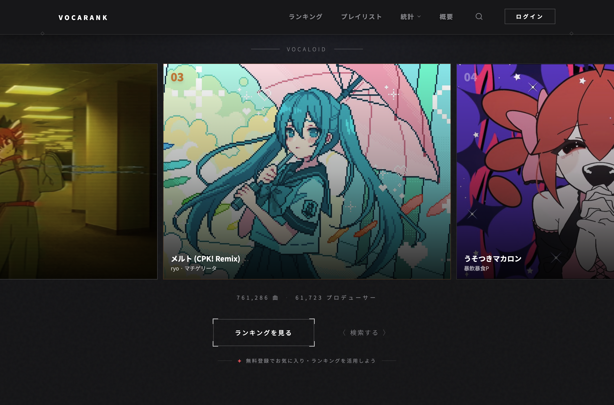
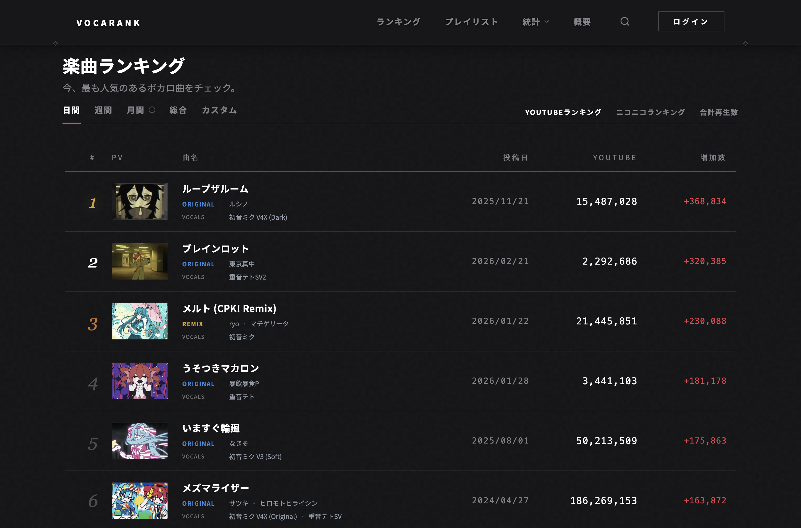
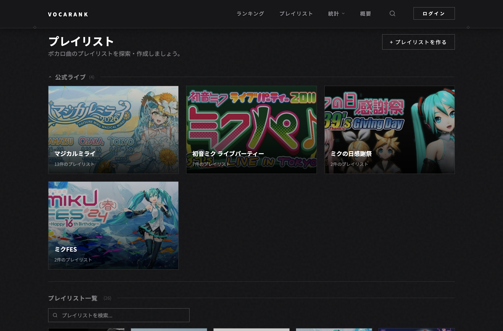
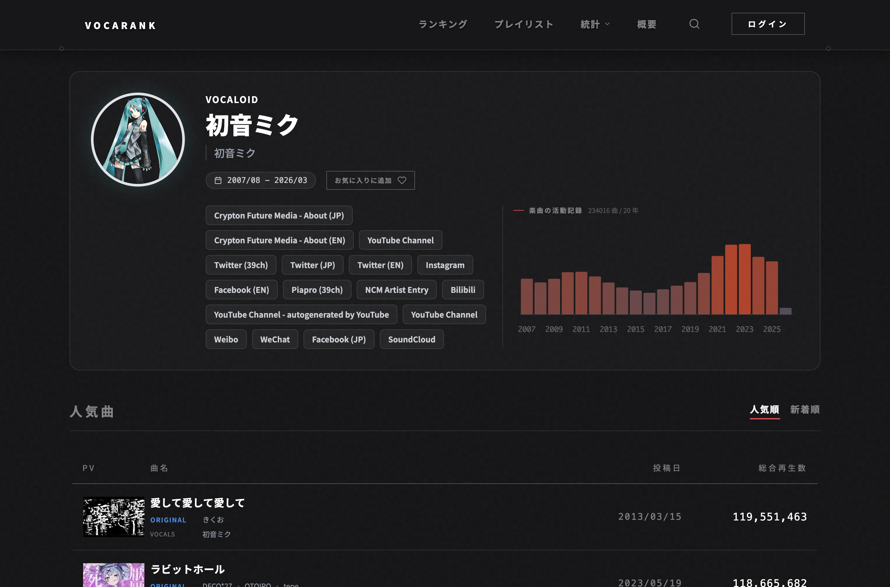
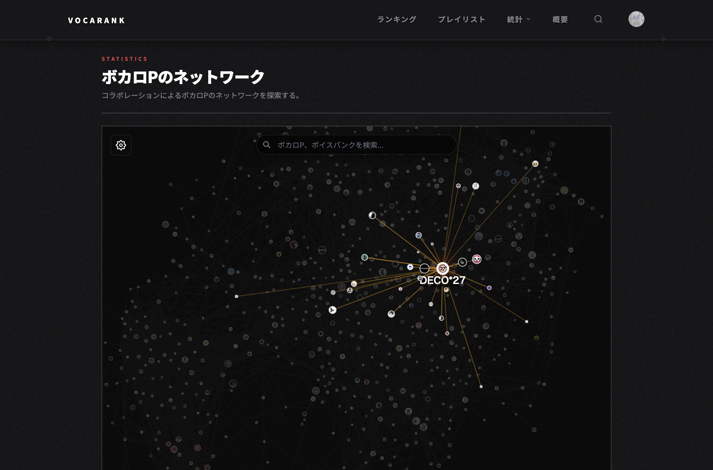
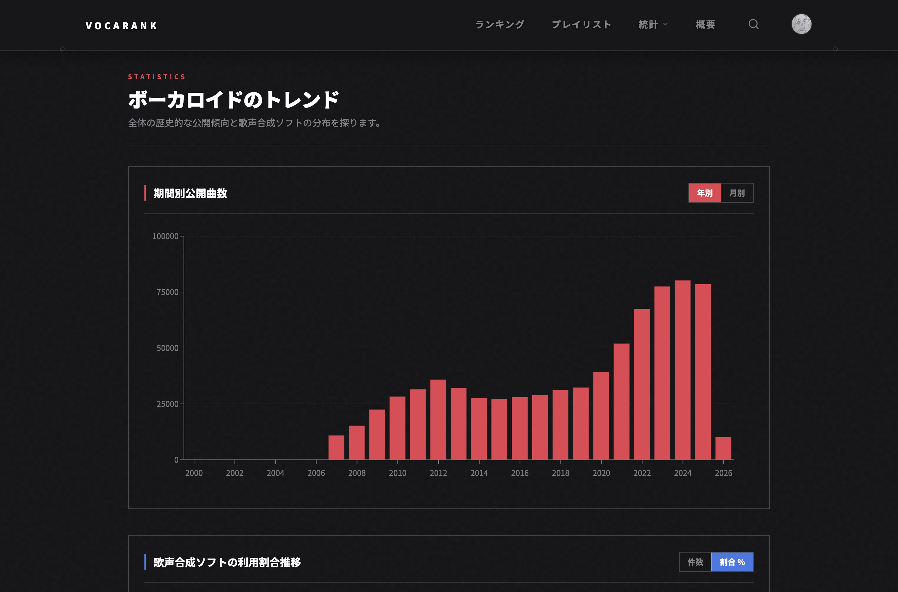
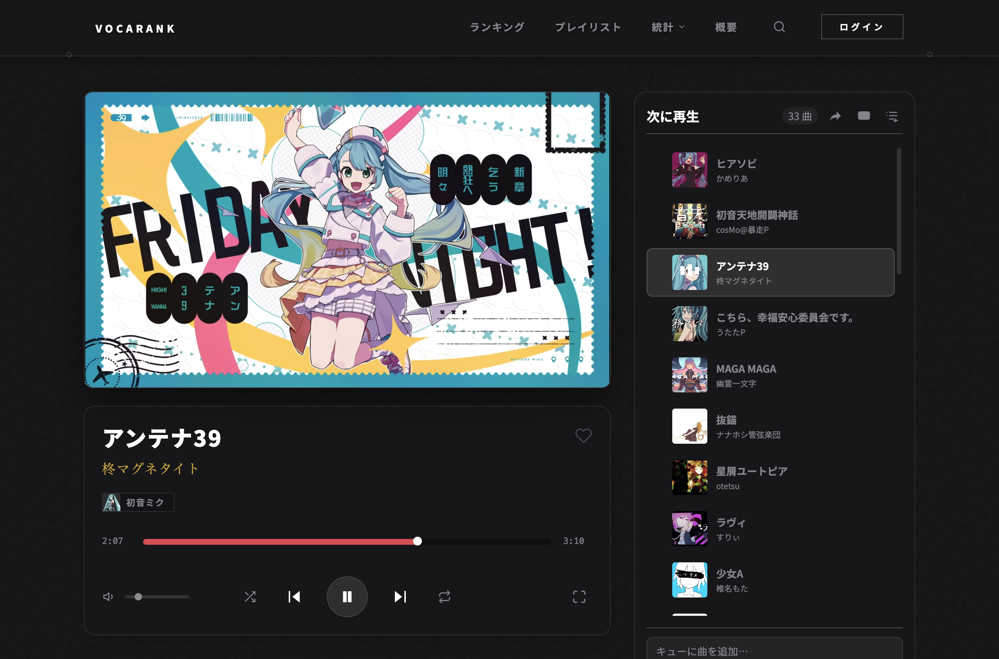
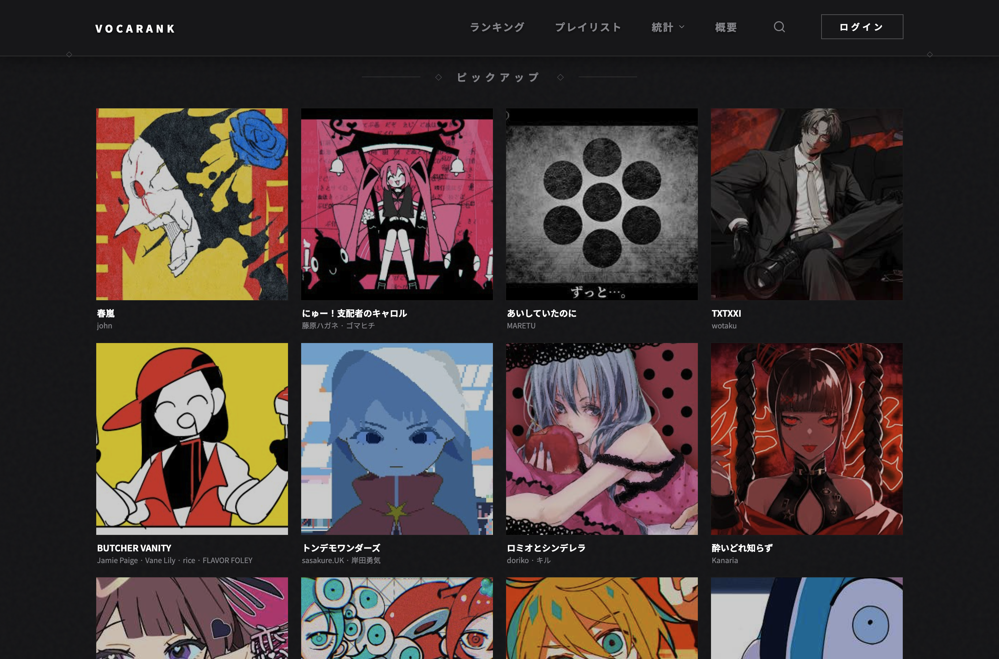

# VocaRank

[English](README.md) | **日本語**

**VocaRank** は、ボーカロイド音楽向けの最も包括的かつ最先端のランキングプラットフォームです。ニコニコ動画と YouTube のリアルタイム再生数を追跡し、日次スナップショットを集計して、VOCALOID・SynthesizerV・UTAU・CeVIO・VoiSona をはじめとするあらゆる音声合成エンジンの楽曲を対象にした最新ランキングを提供します。充実したデータパイプライン、多言語対応、そしてコミュニティ機能を備えた VocaRank は、現在最も高機能なボーカロイドランキングサイトです。

サイト: **[vocarank.live](https://vocarank.live)**

<table>
  <tr>
    <td></td>
    <td></td>
    <td></td>
    <td></td>
  </tr>
  <tr>
    <td></td>
    <td></td>
    <td></td>
    <td></td>
  </tr>
</table>

---

## 機能

- **ランキング** — 日間・週間・月間の再生数増加ランキング、累計ランキング、ボーカル合成エンジン種別によるフィルタリング
- **トレンド** — 再生数が急上昇中の楽曲
- **楽曲・アーティストページ** — メタデータ、再生数履歴グラフ、ムード投票、コメント、PV埋め込み
- **統計** — ボーカロイドエコシステム分析、プロデューサーコラボレーションネットワーク、ボーカリストネットワークグラフ
- **プレイリスト** — ユーザー作成プレイリスト、管理者によるオフィシャルライブコレクション
- **お気に入り** — 楽曲・アーティストをプロフィールにブックマーク
- **検索** — 楽曲・アーティストの全文検索
- **プレイヤー** — 専用タブで動作するキュー式 YouTube プレイヤー
- **報告・ロードマップ** — コミュニティによるバグ報告・機能リクエストとアップボート
- **ユーザープロフィール** — Google OAuth サインイン、アバターアップロード、SNS リンク、エディター権限
- **多言語対応** — English、繁體中文、日本語、العربية、Español

---

## 技術スタック

[](https://skillicons.dev)

| レイヤー | 技術 |
|---|---|
| フロントエンド | Next.js 16、React 19、TypeScript、Tailwind CSS、next-intl |
| バックエンド | FastAPI (Python)、Uvicorn |
| データベース | PostgreSQL 16 |
| 認証 | Google OAuth (NextAuth) + FastAPI JWT（7日間トークン） |
| チャート | Recharts、D3-force、react-player |
| データパイプライン | Python + psycopg2、VocaDB API、YouTube Data API v3 |

---

## リポジトリ構成

```
VocaRank/
├── api/                  # FastAPI バックエンド
│   ├── main.py           # アプリエントリーポイント・ルーター登録
│   ├── models.py         # SQLAlchemy ORM モデル
│   ├── routers/          # songs, artists, rankings, auth, favorites,
│   │                     #   votes, statistics, playlists, official_lives, about
│   ├── cache.py          # インメモリ TTLCache（有効期限 1 時間）
│   └── utils.py          # SYNTH_TYPES、共通ヘルパー
├── scripts/              # データパイプライン（リポジトリルートから Python モジュールとして実行）
│   ├── core.py           # 共通 DB 接続・VocaDB API ヘルパー
│   ├── fetch_new.py      # VocaDB から新規楽曲・アーティストを取得
│   ├── update_existing.py# メタデータのローリング更新
│   ├── fetch_views.py    # YouTube + ニコニコ再生数取得・日次スナップショット作成
│   ├── calculate_rankings_cache.py        # ranking_cache テーブルの事前計算
│   ├── calculate_vocaloid_stats_cache.py  # statistic_cache テーブルの事前計算
│   └── calculate_network_graph.py         # プロデューサー・ボーカリスト協力グラフ生成
├── website/              # Next.js フロントエンド
│   ├── src/app/[locale]/ # ページ: ranking, search, song, artist, player,
│   │                     #         favorites, playlist, profile, statistic,
│   │                     #         trending, about, login
│   ├── src/lib/api.ts    # FastAPI 呼び出しラッパー
│   ├── src/i18n/         # next-intl ルーティング・リクエストヘルパー
│   └── messages/         # 翻訳ファイル (en, zh-TW, ja, ar, es)
├── docs/                 # 詳細ガイド
│   ├── deployment.md     # 本番環境構築 (Ubuntu, systemd, NGINX, cron)
│   ├── database.md       # スキーマ、サイズ見積もり、チューニング、バックアップ
│   └── admin.md          # 管理者・エディター権限、オフィシャルライブ
├── run_vocarank.sh       # データパイプラインコマンドのラッパースクリプト
├── database_backup.sh    # PostgreSQL ダンプ・ローテーションスクリプト
├── crontab.example       # 本番環境向けクロンタブの参考例
└── .env.example          # 環境変数テンプレート
```

---

## ローカル開発

### 前提条件

- Python 3.11+、Node.js 20+、PostgreSQL 16
- リポジトリルートに `.env` ファイル（`.env.example` からコピー）

### セットアップ

```bash
git clone <repo-url> VocaRank
cd VocaRank
cp .env.example .env
# 各値を入力（後述の環境変数設定を参照）

# Python 依存パッケージ
pip3 install -r requirements.txt
pip3 install Pillow

# フロントエンド依存パッケージ
cd website && npm install && ln -sf ../.env .env.local && cd ..
```

### サービス起動

```bash
# ターミナル 1 — FastAPI (http://localhost:8000/docs)
uvicorn api.main:app --host 0.0.0.0 --port 8000 --reload

# ターミナル 2 — Next.js (http://localhost:3000)
cd website && npm run dev
```

両サービスの停止・再起動: `fuser -k 3000/tcp; fuser -k 8000/tcp`

---

## 環境変数

| 変数名 | 説明 |
|---|---|
| `DATABASE_URL` | `postgresql://vocarank:<password>@localhost/vocarank` |
| `AUTH_GOOGLE_ID` | Google OAuth クライアント ID |
| `AUTH_GOOGLE_SECRET` | Google OAuth クライアントシークレット |
| `AUTH_SECRET` | 32文字のランダム文字列 — `openssl rand -base64 32`（NextAuth 用） |
| `JWT_SECRET` | 32文字のランダム文字列 — `openssl rand -base64 32`（FastAPI JWT 用） |
| `NEXTAUTH_URL` | サイトのベース URL（例: `https://vocarank.live`） |
| `YOUTUBE_KEYS_GENERAL` | カンマ区切りの YouTube Data API v3 キー（全楽曲更新用） |
| `YOUTUBE_KEYS_POPULAR` | カンマ区切りの YouTube API キー（人気楽曲の頻繁な更新用） |

Google OAuth の設定: 認証済み JavaScript オリジンにドメインを、リダイレクト URI に `<ドメイン>/api/auth/callback/google` を設定してください。

---

## データパイプライン

全コマンドのログは `logs/cron.log` に出力されます。リポジトリルートから実行してください。

```bash
./run_vocarank.sh fetch-new                             # VocaDB から新規楽曲・アーティストを取得
./run_vocarank.sh update-existing --songs 20000         # 旧楽曲メタデータのローリング更新
./run_vocarank.sh update-existing --newest-songs 20000  # 最近追加された楽曲の更新
./run_vocarank.sh update-existing --artists 10000       # アーティストプロフィールのローリング更新
./run_vocarank.sh update-existing --song <id>           # 特定楽曲の強制更新
./run_vocarank.sh views all                             # 全楽曲の再生数取得・日次スナップショット作成
./run_vocarank.sh views popular                         # 人気楽曲のみ再生数取得
./run_vocarank.sh views-song <id>                       # 特定楽曲の再生数取得
./run_vocarank.sh rankings                              # ranking_cache テーブルの事前計算
./run_vocarank.sh vocaloid-stats                        # statistic_cache テーブルの事前計算
```

---

## 関連ドキュメント

- [デプロイガイド](docs/deployment.md) — Ubuntu 環境構築、systemd、NGINX、SSL、cron ジョブ
- [データベース](docs/database.md) — スキーマ、サイズ・成長見積もり、PostgreSQL チューニング、バックアップ
- [管理者・エディターガイド](docs/admin.md) — 権限付与、オフィシャルライブ、アナウンス管理
- [VocaDB](https://vocadb.net) — 楽曲・アーティストのメタデータはコミュニティ運営のボーカロイド音楽データベース VocaDB から提供されています

---

## お問い合わせ

コントリビューション、研究・データ利用に関するお問い合わせは以下までご連絡ください:

**vocaloid.rankings@gmail.com**
